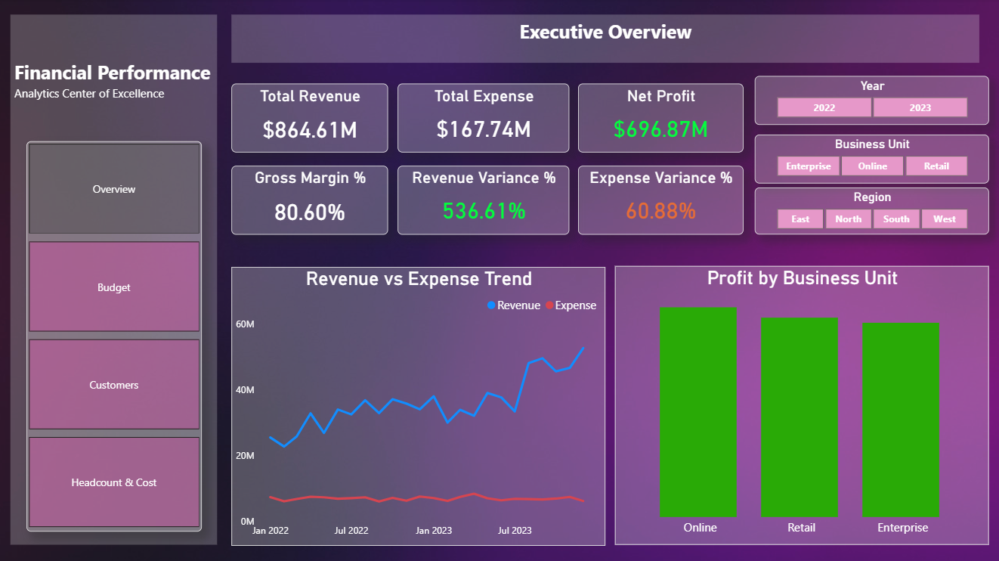
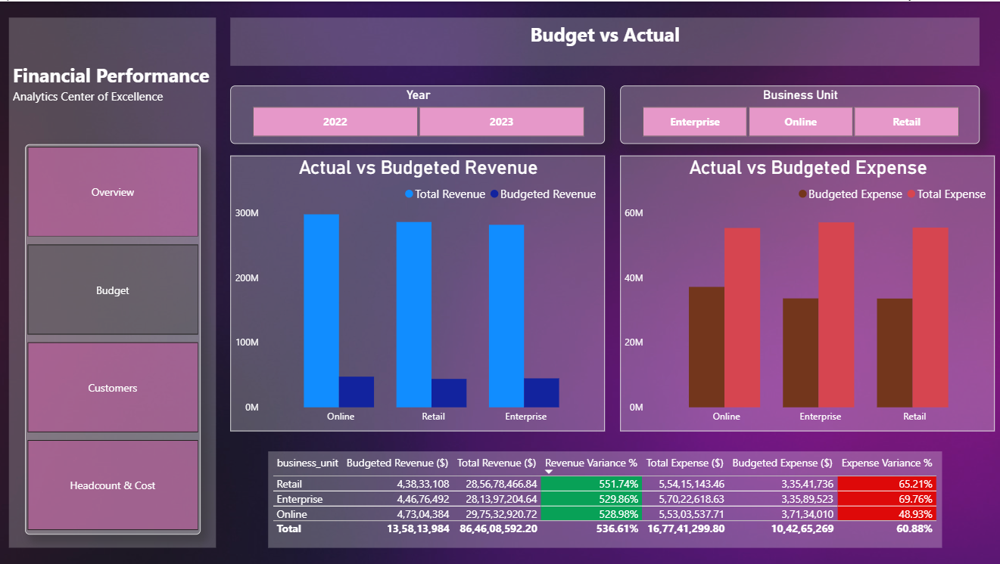
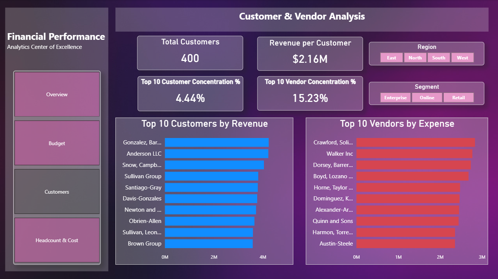
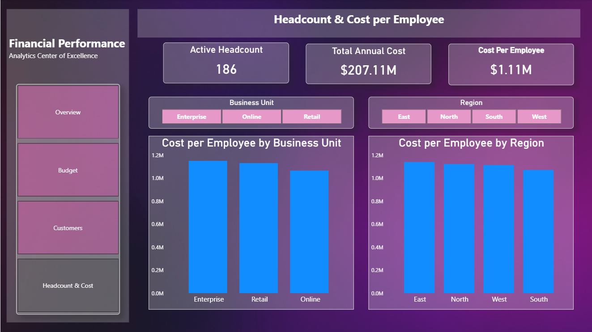
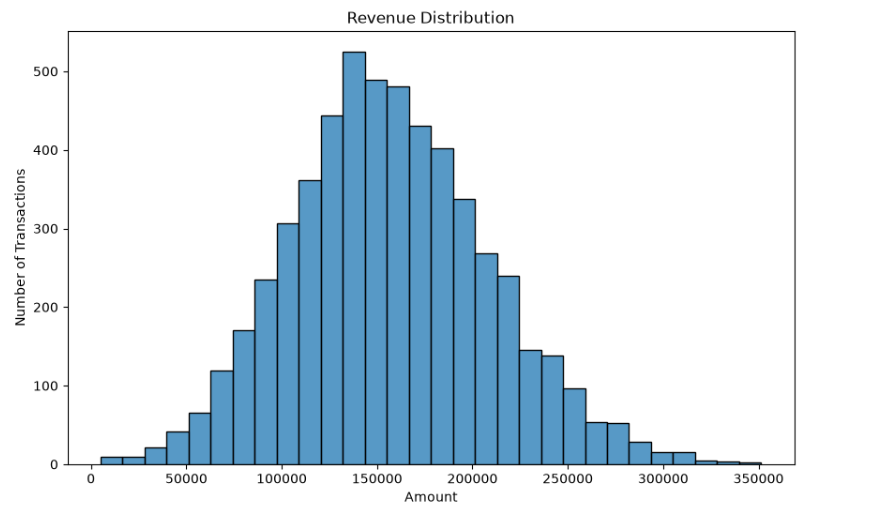
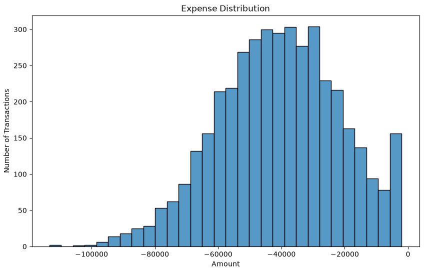
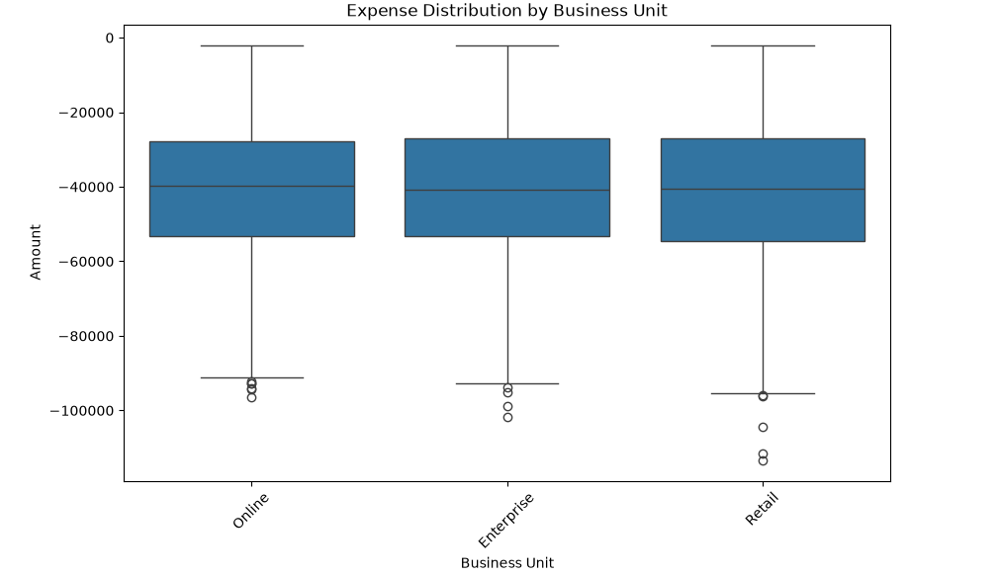
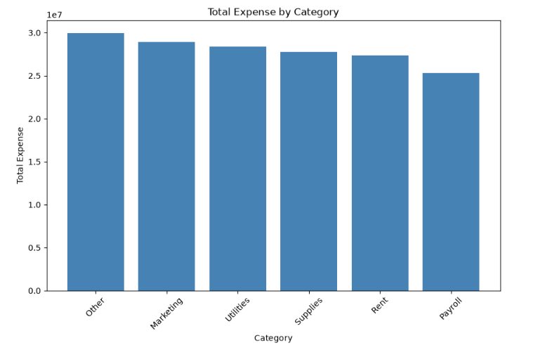
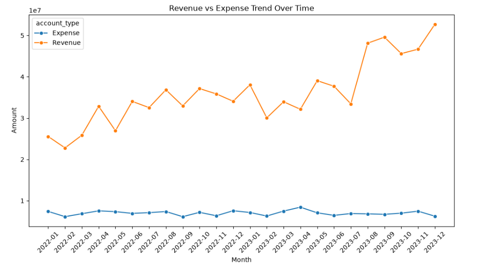

# Financial Performance Analysis

End-to-end financial analytics capstone project — turning two years of raw transaction, budget, headcount, customer, and vendor data into a validated, decision-ready analysis and an interactive executive dashboard.

**Author:** Gopal Sarkar

---

## Business Problem

Leadership needed a clear, current view of financial health: whether revenue and costs are on track, where budgets are slipping, and who the most valuable customers and costliest vendors are. This project answers those questions using 10,400 transactions across 5 linked datasets spanning January 2022 – December 2023.

## Tools & Methodology

| Tool | Used for |
|---|---|
| **Excel** | Data validation — missing-value, duplicate, and category checks |
| **MySQL** | Relational schema design, PK/FK integrity, data loading |
| **Python (pandas)** | KPI calculation, EDA, budget variance analysis, outlier detection |
| **SciPy** | Statistical hypothesis testing (ANOVA, t-test, chi-square) |
| **Matplotlib / Seaborn** | Distribution, trend, and variance visualizations |
| **Power BI** | 4-page interactive executive dashboard |

## Data Validation

10,400 transactions validated across 5 relational tables — **0 duplicate primary keys, 0 orphaned foreign keys, 0 unexpected missing values.** The only "missing" values found (`customer_id` blank on Expense rows, `vendor_id` blank on Revenue rows) were confirmed as a structural pattern by design, not a data defect — an expense has no paying customer, a sale has no vendor.

## Key Findings

| KPI | Value |
|---|---|
| Total Revenue | $864.6M |
| Total Expense | $167.7M |
| Net Profit | $696.9M |
| Gross Margin | 80.6% |
| Revenue vs. Budget | +536.6% |
| Expense vs. Budget | +60.9% |

**Statistical testing** (95% confidence level) found no statistically significant variance across business units, regions, or customer segments:

| Test | Hypothesis | Result |
|---|---|---|
| ANOVA | Expense differs across business units | F = 0.235, p = 0.791 — not significant |
| t-test | Revenue differs between regions (East vs. West) | t = 0.746, p = 0.456 — not significant |
| Chi-square | Customer segment is associated with purchase category | χ² = 2.206, df = 4, p = 0.698 — not significant |

Performance is genuinely consistent company-wide — it isn't being propped up by one outlier unit, region, or segment. The real story is the gap between budgeted and actual figures, not an underperforming part of the business.

**Customer & vendor concentration:**
- Top 10 customers = 4.44% of total revenue across 400 active accounts (low concentration risk)
- Top 10 vendors = 15.23% of total expense across 120 active vendors (worth monitoring)

## Dashboard Preview

**Executive Overview**


**Budget vs. Actual**


**Customer & Vendor Analysis**


**Headcount & Cost**


## Exploratory Analysis (Python)

| | |
|---|---|
|  |  |
|  |  |



## Recommendations

1. **Rebuild the budgeting baseline** using 2022–2023 actuals, not the original conservative targets, as the starting point for next year's budget.
2. **Maintain the current operating structure** — hypothesis testing found no statistically significant variance by unit, region, or segment, so no structural reallocation is currently justified.
3. **Reduce vendor concentration risk** by diversifying or renegotiating terms with the top 10 vendors representing 15.23% of spend.
4. **Formalize the data-validation process** — turn the PK/FK, category, and range checks used here into a recurring monthly routine.

## Future Scope

- Predictive forecasting (regression/time-series) as more periods accumulate
- Live Power BI refresh directly against MySQL instead of static CSV snapshots
- Interaction-effect testing (region × business unit)
- Automated anomaly alerts on outlier transactions
- Entity-level profitability beyond aggregate top-10 concentration

## Repository Structure

```
Financial-Performance-Analysis/
├── README.md
├── SQL/
│   └── create_tables_and_load.sql
├── Raw_Data/
│   ├── Customers.csv
│   ├── Vendors.csv
│   ├── Headcount.csv
│   ├── Budget.csv
│   └── Financial_Transactions.csv
├── Excel_Validated_Data/
│   ├── Customers_validated.xlsx
│   ├── Vendors_validated.xlsx
│   ├── Headcount_validated.xlsx
│   ├── Budget_validated.xlsx
│   └── Financial_Transactions_validated.xlsx
├── Python_Notebook/
│   └── financial_analysis.ipynb
├── PowerBI/
│   └── Financial_Performance_Dashboard.pbix
├── Images/
│   ├── dashboard-01-executive-overview.png
│   ├── dashboard-02-budget-vs-actual.png
│   ├── dashboard-03-customer-vendor.png
│   ├── dashboard-04-headcount-cost.png
│   ├── python-01-revenue-distribution.png
│   ├── python-02-expense-distribution.png
│   ├── python-03-expense-by-business-unit.png
│   ├── python-04-expense-by-category.png
│   └── python-05-revenue-expense-trend.png
├── Report/
│   └── Executive_Summary.docx
└── Presentation/
    └── Financial_Performance_Analysis.pptx
```

## Data Dictionary

| Table | Description |
|---|---|
| `customers` | Customer master data (name, segment, join date, region, status) |
| `vendors` | Vendor master data (name, category, region, active status) |
| `headcount` | Employee master data (name, business unit, join date, status, region, CTC) |
| `budget` | Budget allocations by year, month, business unit |
| `financial_transactions` | All financial transactions (date, amount, type, category, business unit, region) |
